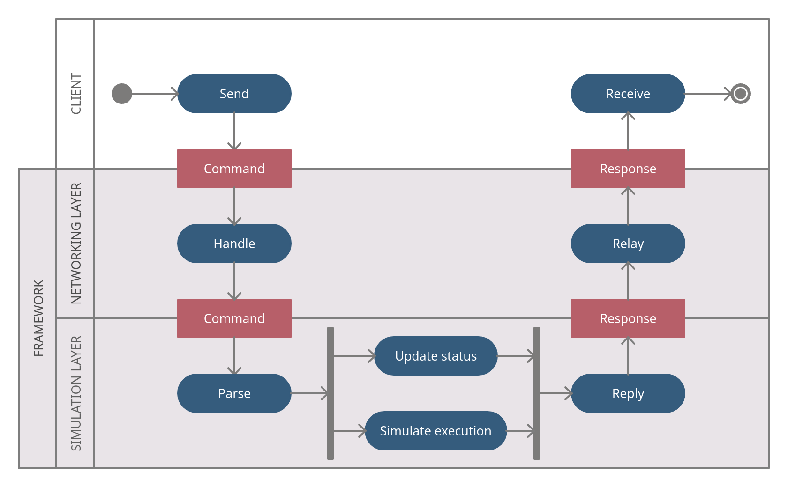

.. _framework:

*************
The Framework
*************

.. only:: html

   .. topic:: Abstract

      This chapter will give the reader an overview on how the framework works,
      from which classes it is composed, and how they interact with one
      another, in order to simulate a subsystem of a radio telescope.

The framework is composed of two layers of architecture. The topmost layer is
in charge of handling network communications, it behaves as a server, listening
for incoming connections from clients and relaying every received byte to the
other layer of the framework, the simulation layer. This layer is where
received commands are parsed and executed, it can faithfully replicate the
behavior of the hardware it is supposed to simulate, or it can simply answer
back to clients with a simple response, whether the latter is the correct one
or not, to simulate an error condition and thoroughly test the `DISCOS` control
software.

.. _layers:

   Framework layers and communication behavior.

.. raw:: latex

   \clearpage

Networking layer
================

The `Simulator` class
---------------------
The `Simulator` class represents the topmost layer of the framework. Each
simulator system can have multiple instances or servers to be launched
(i.e. the Active Surface simulator has 96 different instances), this class has
the task to start a server process for each of the instances needed for the
given simulator.

.. module:: simulators.server

.. autoclass:: Simulator
   :members:
   :inherited-members:

The `Server` class
------------------
As previously mentioned, every simulator exposes one or multiple server
instances via network connection. Each server instance is an object of the
`Server` class, its purpose it to listen on a given port for incoming
communications from any client. This class inherits from the
`SocketServer.ThreadingMixIn` class and, depending on which type of socket it
will use, it also inherits either from the `SocketServer.ThreadingTCPServer`
class or from the `SocketServer.ThreadingUDPServer` class. The reader can find
more information about the `system` parameter in the :ref:`system` section.

.. autoclass:: Server
   :members:

The `Server` class is capable of behaving in three different ways.
The first one is to act as a listening server, a server that awaits for
incoming commands and sends back the answers to the client.
The second possible behavior is to act as a sending server, sending its status
message periodically to its clients after they start any communication.
Finally, a server can act as a combined version of the aforementioned two.
It is therefore able to behave as both listening and sending server on two
different ports but relaying incoming commands to and sending the status of a
single simulator object to its connected clients.
Depending on how a server is configured to behave, it will use different
handler classes to manage communications with its clients.

Handler classes of a `Server`
-----------------------------
The handler class of a server object, is the endpoint class, in charge of
handling any communication between the server object and its underlying
simulator. Depending on the type of handler a server object has underneath,
its behavior when receiving a message will be different.

The `BaseHandler` class
~~~~~~~~~~~~~~~~~~~~~~~
The main handler class in the framework is the `BaseHandler` class. It inherits
from the `BaseRequestHandler` class.

.. autoclass:: BaseHandler
   :members:
   :inherited-members:

   .. autoattribute:: custom_header
   .. autoattribute:: custom_tail
   .. automethod:: _execute_custom_command

The `BaseHandler` class alone is not able to handle any incoming message, its
only purpose in fact is to act as a base class for the following two classes,
providing its children classes the `_execute_custom_command` method.

The `ListenHandler` class
~~~~~~~~~~~~~~~~~~~~~~~~~
The `ListenHandler` class, as its name suggests, listens for incoming
messages from any client, and relays these messages to the underlying
simulator. If the simulator answers with a response message, this one gets sent
back to the client.

.. autoclass:: ListenHandler
   :members:

The `SendHandler` class
~~~~~~~~~~~~~~~~~~~~~~~
The `SendHandler` class, as soon as a client opens a communication channel,
starts retrieving and sending periodically the status message of its underlying
simulator class to its connected clients.

.. autoclass:: SendHandler
   :members:

.. raw:: latex

   \clearpage

Simulation layer
================

.. _system:

The `System` class
------------------
The `System` class is the main class of any hardware simulator. It is the class
in charge of parsing any incoming command received from the `Handler` object of
the `Server`, and/or periodically provide the status of the simulator it is
supposed to be mimicking.

The `BaseSystem` class
~~~~~~~~~~~~~~~~~~~~~~
The `BaseSystem` class is simply bare implementation of a full `System` class.
This class is the right place where to implement any custom method that can be
helpful to handle some behavior that is common to all simulators. As it can be
seen from the API below, it is the case of `system_greet()` and `system_stop()`
methods, which have to be defined for every simulator. They can be overridden
in case a `System` object has to behave differently than the default
implementation.

.. module:: simulators.common

.. autoclass:: BaseSystem
   :members:

In order for a system object to be able to either parse commands or send its
status to any connected client, writing a `System` class that inherits from
`BaseSystem` is not enough. The `System` class of a simulator in fact has to
inherit from one (or both) of the two classes described below. It the `System`
class inherits from both the classes, it will have to implement all the
required methods and define the required attributes.

The `ListeningSystem` class and the `parse` method
~~~~~~~~~~~~~~~~~~~~~~~~~~~~~~~~~~~~~~~~~~~~~~~~~~
For a `System` class to be able to parse any command received by the server and
relayed to it via the handler object, it must define a `parse` method.
This method takes one byte (string of one character, in Python 2.7) as argument
and returns:

* `False` when the byte is not recognized as a message header and the system is
  still waiting for the correct header character
* `True` when the system has already received the header and it is waiting to
  receive the rest of the message
* a response to the client, a non empty string, built according to the protocol
  definition. The syntax of the response thus is different between different
  simulators.

If the system has nothing to send to the client, as in the case of broadcast
requests, `System.parse()` must return `True`.
When the simulator is lead to behave unexpectedly, a `ValueError` has to be
raised, it will be captured and logged by the parent server process.

.. autoclass:: ListeningSystem
   :members:

The `SendingSystem` class and the `subscribe` and `unsubscribe` methods
~~~~~~~~~~~~~~~~~~~~~~~~~~~~~~~~~~~~~~~~~~~~~~~~~~~~~~~~~~~~~~~~~~~~~~~
If the `System` class inherits from `common.SendingSystem`, it has to define
and implement the `System.subscribe()` and `System.unsubscribe()` methods,
along with the `sampling_time` attribute.

Both the `System.subscribe()` and `System.unsubscribe()` methods interfaces are
described in `issue #175 <https://github.com/discos/simulators/issues/175>`__
on GitHub.

The `subscribe` method takes a queue object as argument and adds it to the list
of the connected clients. For each client in this list the system will then be
able to send the required message by putting it into each of the clients queues.

The `unsubscribe` method receives once again the same queue object received by
the `subscribe` method, letting the system know that that queue object,
relative to a disconnecting client, has to be removed from the clients queues.

The `sampling_time` attribute defines the time period (in milliseconds)
that elapses between two consecutive messages that the system have to send
to its clients. It is internally defined in the `SendingSystem` base class,
and its default value is equal to 10ms. If a different sampling time is needed,
it is sufficient to override this variable in the inheriting `System` class.

.. autoclass:: SendingSystem
  :members:

   .. autoattribute:: sampling_time

.. _classes:

.. figure:: images/classes.png

   System class inheritance.

The `MultiTypeSystem` class
---------------------------
Some simulators might have multiple different implementations, having therefore
multiple `System` classes that behave differently from one another. In order
to keep different `System` classes under the same simulator name, another class
called `MultiTypeSystem` was written, it acts as a `class factory`. This means
that it works by receiving the name of the configuration of the system we want
to launch as `system_type` keyword argument.

.. autoclass:: MultiTypeSystem
   :members:

   .. automethod:: __new__

The main `System` class, just like a regular `System` class, should be
defined in the `__init__.py` file, inside the module main directory. It must
inherit from the `MultiTypeSystem` class and override the `__new__` method
as shown below::

    systems = get_multitype_systems(__file__)

    class System(MultiTypeSystem):

        def __new__(cls, **kwargs):
            cls.systems = systems
            cls.system_type = kwargs.pop('system_type')
            return MultiTypeSystem.__new__(cls, **kwargs)

As you can see from the code above, before defining the class, it is necessary
to retrieve the list of the available configurations for the given simulator.
This can be done by calling the `get_multitype_systems` function, defined in
the :ref:`utils` library. The said function will recursively search for any
`System` class in the given path. Generally speaking, the passed `__file__`
value will ensure that only the `System` classes defined in the module's
directory and sub-directories will end up inside the `systems` list. For more
information, take a look at the :ref:`function<get_multitype_systems>` in the
:ref:`utils` section. The default system configuration can be defined as
`system_type` inside the `kwargs` dictionary.
